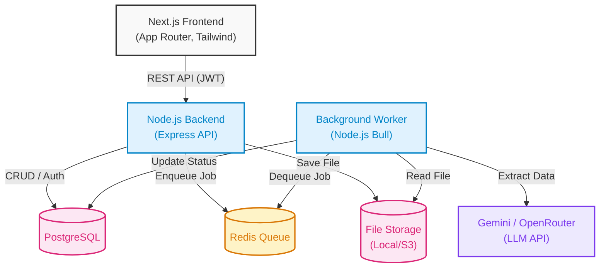

# ReceiptMind Enterprise

ReceiptMind is an AI-powered receipt processing platform built for operators, finance teams, and modern enterprises. Stop typing manual expenses and start uploading.

## 🚀 Features

- **✅ AI Extraction Engine:** Powered by Gemini/OpenRouter to automatically extract Vendor, Amount, Date, and Category from raw images and PDFs.
- **✅ Confidence Scoring:** Receipts with low confidence (<75%) are automatically routed to the Exceptions Inbox for human review.
- **✅ Asynchronous Processing:** Redis + Bull queue ensures zero dropped uploads, processing files in the background.
- **✅ Multi-Tenant Organizations:** Every receipt, user, and rule is strictly scoped to an organization.
- **✅ Smart Rules Engine:** Auto-categorize receipts based on vendor conditions.
- **✅ Dashboard & UI:** A sleek, premium, "Apple-esque" SaaS dashboard with data grids, bulk actions, and side-panel editing.
- **✅ CSV Export:** Filter receipts by date, amount, or status and export to CSV instantly.
- **✅ Duplicate Detection:** Blocks duplicate file uploads by computing SHA-256 hashes.
- **✅ JWT Security:** Secure session handling with HttpOnly refresh tokens and short-lived access tokens.

## 🏗 High-Level Architecture

ReceiptMind is built on a modern decoupled stack:



### Components:
1. **Frontend:** Next.js 14 App Router, Tailwind CSS, React Query, Lucide Icons.
2. **Backend API:** Node.js, Express, jsonwebtoken, pg (node-postgres).
3. **Background Worker:** A standalone Node process that consumes Bull queue jobs, reads from storage, and communicates with Gemini for OCR and data extraction.
4. **Data Layer:** PostgreSQL for relational data, Redis for queues.

## 📊 Peak Booking System & Automatic CSV Export

The system automatically logs every successfully processed receipt into an Excel-friendly CSV ledger located at `backend/exports/receipts_peak.csv`.

- **Excel Compatibility:** The exported file is pre-formatted with a UTF-8 BOM (`\ufeff`) header and fields are escaped using double-quotes to ensure seamless rendering without configuration issues when opened in Microsoft Excel.
- **Workflow:** 
  1. Receipt Uploaded via `POST /receipts/upload`.
  2. OCR extracted by Tesseract.js.
  3. Gemini AI models extract structured receipt fields (Vendor, Amount, Currency, Category, Date, Confidence).
  4. Auto-rules applied.
  5. The details are recorded in the database, and the record is appended as a line to the `receipts_peak.csv` log.

### Columns Exported:
- `Receipt ID`
- `Vendor Name`
- `Amount`
- `Currency`
- `Category`
- `Receipt Date`
- `Confidence`
- `Status`

## 🧪 Development Setup

To run locally without Docker:

**1. Database Setup:**
Ensure PostgreSQL and Redis are running on your machine.
Run the schema migrations located in `nodejs-backend/src/db/migrations/`.

**2. Backend:**
```bash
cd nodejs-backend
npm install
npm run dev
```

**3. Frontend:**
```bash
cd frontend
npm install
npm run dev
```

## 🔐 Security & Auth

ReceiptMind uses an industry-standard dual-token system:
- **Access Tokens:** Short-lived JWTs (15m) passed in the `Authorization` header.
- **Refresh Tokens:** Long-lived JWTs (7d) stored securely in the `sessions` database table and validated on the `/api/auth/refresh` endpoint.
- **Hashing:** Passwords are cryptographically hashed using `bcryptjs`.
