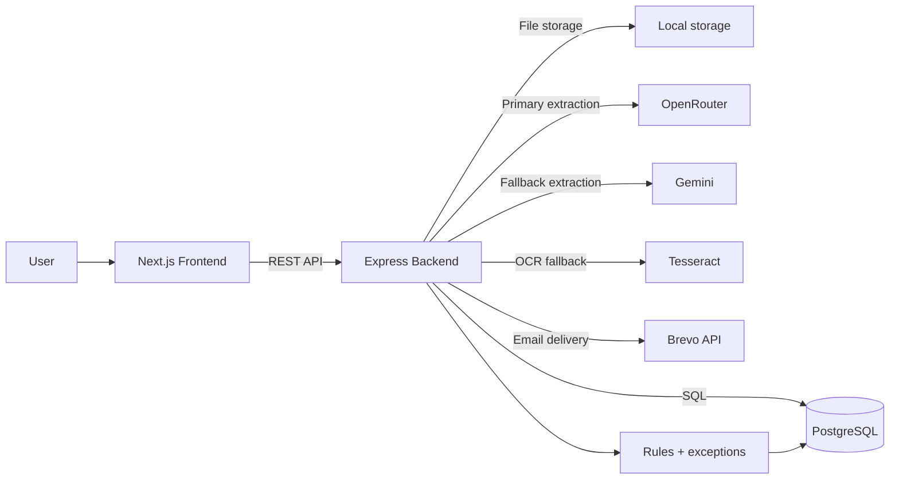
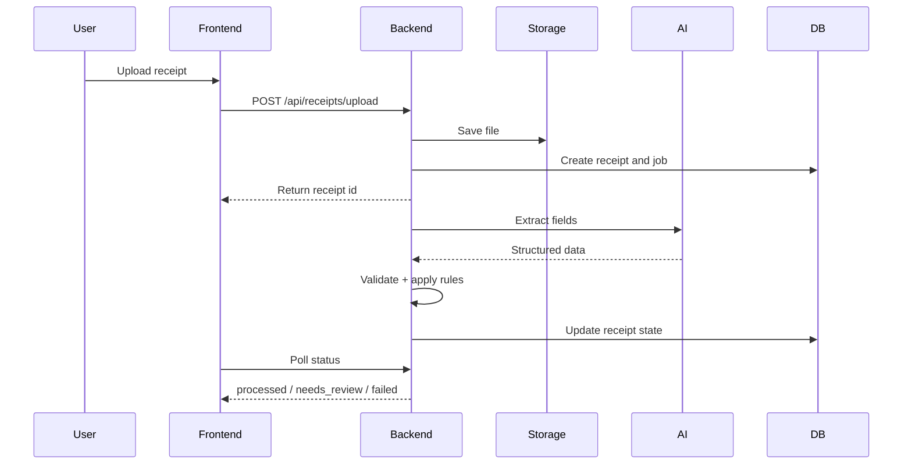

# ReceiptMind Enterprise

ReceiptMind Enterprise is a monorepo with a Next.js frontend and an Express backend for receipt upload, AI extraction, review, rules, exceptions, and CSV export.

## Architecture



## Flow



## Structure

```text
receiptmind-enterprise/
|- backend/
|- frontend/
|- docs/
`- render.yaml
```

## Local Dev

- `npm run install:all`
- `npm run backend:dev`
- `npm run frontend:dev`

## Deploy

Frontend on Vercel:

- Root directory: `frontend`
- Build command: `npm run build`

Backend on Render:

- Root directory: `backend`
- Build command: `npm install && npm run build`
- Start command: `npm start`

## Docs

- [Backend guide](backend/README.md)
- [Frontend guide](frontend/README.md)
- [System flow](docs/FLOW.md)
