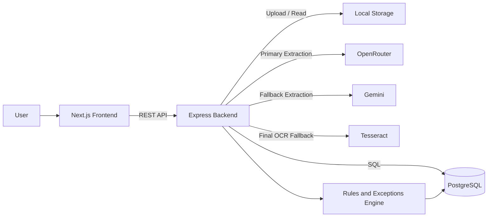
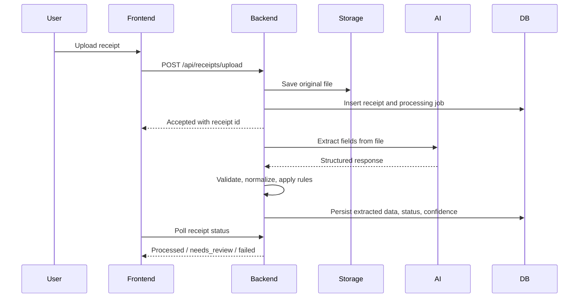

# ReceiptMind Enterprise

ReceiptMind Enterprise is a two-app monorepo for receipt ingestion, AI-assisted extraction, review workflows, rules, exceptions, and CSV export.

- `frontend/`: Next.js application intended for Vercel
- `backend/`: Express API intended for Render
- `docs/`: high-level product and system flow notes

## Architecture



## Processing Flow



## Monorepo Structure

```text
receiptmind-enterprise/
|- backend/
|  |- src/
|  |  |- config/       # database and runtime configuration
|  |  |- controllers/  # HTTP request handlers
|  |  |- db/           # schema and SQL migrations
|  |  |- middleware/   # auth and request middleware
|  |  |- routes/       # API route registration
|  |  |- services/     # extraction, storage, rules, exports, email
|  |  |- utils/        # shared helpers
|  |  |- app.js        # express app assembly
|  |  `- index.js      # process bootstrap
|  |- uploads/         # local file storage
|  |- exports/         # generated CSV files
|  `- README.md
|- frontend/
|  |- app/             # Next.js App Router screens
|  |- components/      # UI building blocks
|  |- hooks/           # client data hooks
|  |- lib/             # env, API, auth, shared client logic
|  |- public/          # static assets
|  `- README.md
|- docs/
|  `- FLOW.md
`- render.yaml
```

## Runtime Model

The backend uses a staged extraction strategy:

1. `OpenRouter` is tried first for structured receipt extraction.
2. `Gemini` is used as the provider fallback.
3. `Tesseract` runs as the last-resort OCR fallback for image files.
4. The validation layer normalizes fields, computes confidence, and decides whether the receipt is `processed` or `needs_review`.

This keeps the pipeline resilient when one upstream provider is unavailable or rate-limited.

## Local Development

### Prerequisites

- Node.js 20 or newer
- PostgreSQL
- API keys for at least one AI provider

### Install

```bash
npm run install:all
```

### Configure

Copy and fill the environment templates:

- `backend/.env.example` -> `backend/.env`
- `frontend/.env.example` -> `frontend/.env.local`

### Run

```bash
npm run backend:dev
npm run frontend:dev
```

Frontend defaults to `http://localhost:3000` and backend defaults to `http://localhost:3001`.

## Deployment

### Frontend on Vercel

- Set the project root to `frontend`
- Build command: `npm run build`
- Output: default Next.js output
- Required environment variables:
  - `NEXT_PUBLIC_APP_URL`
  - `NEXTAUTH_URL`
  - `NEXTAUTH_SECRET`
  - `NEXT_PUBLIC_API_URL`
  - `BACKEND_API_URL`
  - Supabase values if auth or storage flows depend on them

### Backend on Render

- Set the service root to `backend`
- Build command: `npm install && npm run build`
- Start command: `npm start`
- Node version: 20+
- Attach a PostgreSQL database
- Configure environment variables from `backend/.env.example`

The Render build failure shown earlier was caused by a missing backend `build` script. The backend package now includes a no-op build step so Render can complete its install/build/start pipeline cleanly.

## Key Backend Endpoints

- `POST /api/auth/*`: authentication flows
- `POST /api/receipts/upload`: upload and enqueue receipt processing
- `GET /api/receipts`: list receipts
- `GET /api/files/:id`: stream uploaded file preview
- `GET /api/exports/*`: export history and CSV downloads
- `GET /health`: liveness check

## Operational Notes

- Uploaded files are stored on the backend filesystem by default.
- `FRONTEND_URL` on the backend supports comma-separated origins for local and production clients.
- `NEXT_PUBLIC_API_URL` should point directly to the deployed backend URL.
- OCR fallback is image-only; PDF extraction depends on AI providers.

## Documentation Map

- [Backend guide](backend/README.md)
- [Frontend guide](frontend/README.md)
- [System flow and processing architecture](docs/FLOW.md)
