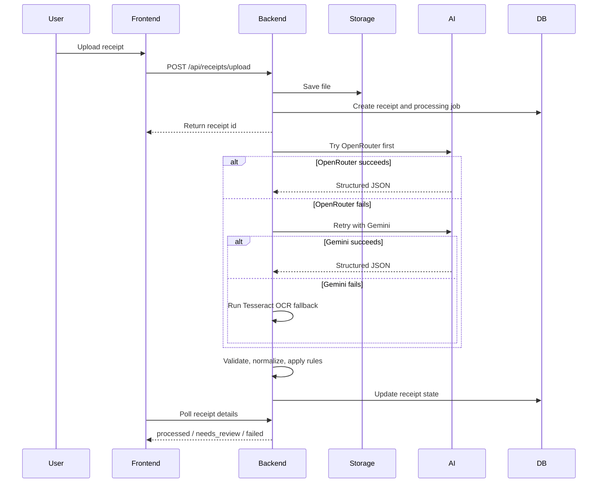
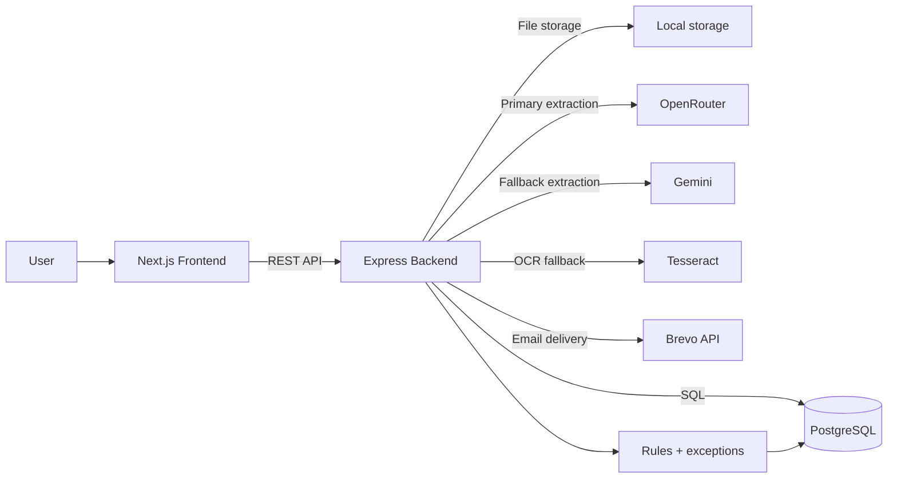

# ReceiptMind 

ReceiptMind is a two-app monorepo for receipt upload, AI extraction, review workflows, rules, exceptions, and CSV export.

## What It Does

- Users sign up, verify email, and sign in.
- Receipts are uploaded from the frontend to the backend.
- The backend stores the file, creates a receipt record, and starts extraction.
- Extraction runs in this order: OpenRouter, Gemini, then Tesseract OCR fallback.
- The backend validates the output, applies rules, and creates exceptions when needed.
- The frontend polls receipt status and lets users review, fix, and export data.

## How It Works



## Architecture



## Folder Structure

```text
receiptmind-enterprise/
|- backend/          # Express API, migrations, services, uploads, exports
|- frontend/         # Next.js app, UI, hooks, auth, and API clients
|- docs/             # Product and system flow notes
`- render.yaml       # Render deployment config for backend
```

## Local Setup

### Requirements

- Node.js 20 or newer
- PostgreSQL
- At least one AI provider key
- Brevo API key and sender for email delivery

### Install

```bash
npm run install:all
```

### Configure

- Copy `backend/.env.example` to `backend/.env`
- Copy `frontend/.env.example` to `frontend/.env.local`
- Fill backend secrets only in the backend env file

### Run

```bash
npm run backend:dev
npm run frontend:dev
```

Frontend defaults to `http://localhost:3000` and backend defaults to `http://localhost:3001`.

## Main Routes

Backend:

- `POST /auth/register`
- `POST /auth/login`
- `POST /auth/verify-email`
- `POST /receipts/upload`
- `GET /receipts`
- `GET /receipts/:id`
- `GET /api/files/:id`
- `GET /exports/csv`
- `GET /exports/history`
- `GET /health`

Frontend:

- `/login`
- `/signup`
- `/dashboard`
- `/receipts`
- `/exceptions`
- `/rules`
- `/api-docs`

## Deployment

### Vercel

- Root directory: `frontend`
- Build command: `npm run build`
- Install command: `npm install`

### Render

- Root directory: `backend`
- Build command: `npm install && npm run build`
- Start command: `npm start`
- Node version: 20+

## Documentation

- [Backend guide](backend/README.md)
- [Frontend guide](frontend/README.md)
- [System flow](docs/FLOW.md)

## Notes

- Files are stored on backend disk by default.
- CSV export reads persisted receipt data from PostgreSQL.
- NextAuth uses the frontend's own `/api/auth/*` routes.
- Brevo secrets stay on the backend only.
