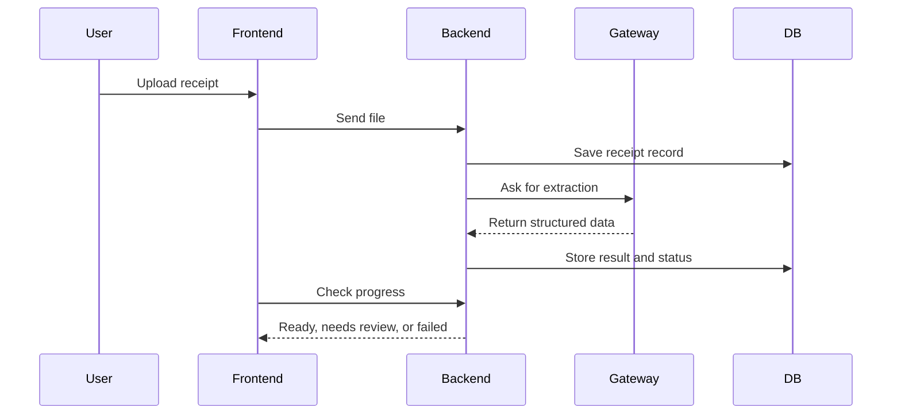

# ReceiptMind Enterprise

ReceiptMind Enterprise is a small monorepo for uploading receipts, pulling out the data, reviewing exceptions, and exporting CSVs.

## Flow

## What Is In Here

- `backend/` handles auth, uploads, rules, exports, and receipts.
- `ai-gateway/` sends AI requests and tries fallback providers when needed.
- `frontend/` is the UI for upload, review, and export.
- `docs/` keeps the bigger flow notes.

## Local Run

- Install: `npm run install:all`
- Start backend: `npm run backend:dev`
- Start frontend: `npm run frontend:dev`
- Start gateway: `npm run gateway:dev`

## Main Routes

- `POST /receipts/upload`
- `GET /receipts`
- `GET /receipts/:id`
- `GET /exports/csv`
- `GET /health`

## Notes

- Files stay on backend disk by default.
- CSV export reads from PostgreSQL.
- Backend keeps the important secrets.
