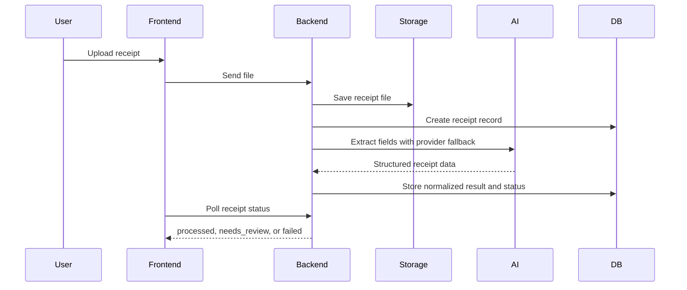

# ReceiptMind Enterprise

ReceiptMind Enterprise is a receipt processing monorepo. Users upload receipts, the backend extracts structured data, rules are applied, exceptions are tracked, and the final data can be reviewed or exported.

## What lives where

- `backend/` is the main Express API for auth, uploads, receipt processing, rules, exceptions, exports, and email flows.
- `frontend/` is the Next.js app for upload, review, dashboard, and export screens.
- `ai-gateway/` is a separate TypeScript Express service for generic AI chat-style requests with provider failover.
- `docs/` contains the higher-level flow notes and architecture docs.

## How the app works

## Quick Start

- Install all dependencies: `npm run install:all`
- Start backend: `npm run backend:dev`
- Start frontend: `npm run frontend:dev`
- Start AI gateway: `npm run gateway:dev`

## Useful Paths

- `backend/README.md` explains the API, environment variables, and backend processing flow.
- `ai-gateway/README.md` explains the standalone AI gateway.
- `docs/FLOW.md` documents the full receipt lifecycle in more detail.

## Common API Routes

- `POST /api/receipts/upload`
- `GET /api/receipts`
- `GET /api/receipts/:id`
- `GET /api/receipts/export/csv`
- `GET /api/receipts/exports/history`
- `POST /api/auth/login`
- `GET /health`

## Notes

- Uploaded files are stored on backend disk by default.
- CSV export reads from PostgreSQL.
- Backend secrets stay server-side.
- The receipt processor uses OpenRouter first and falls back to Gemini when needed.
