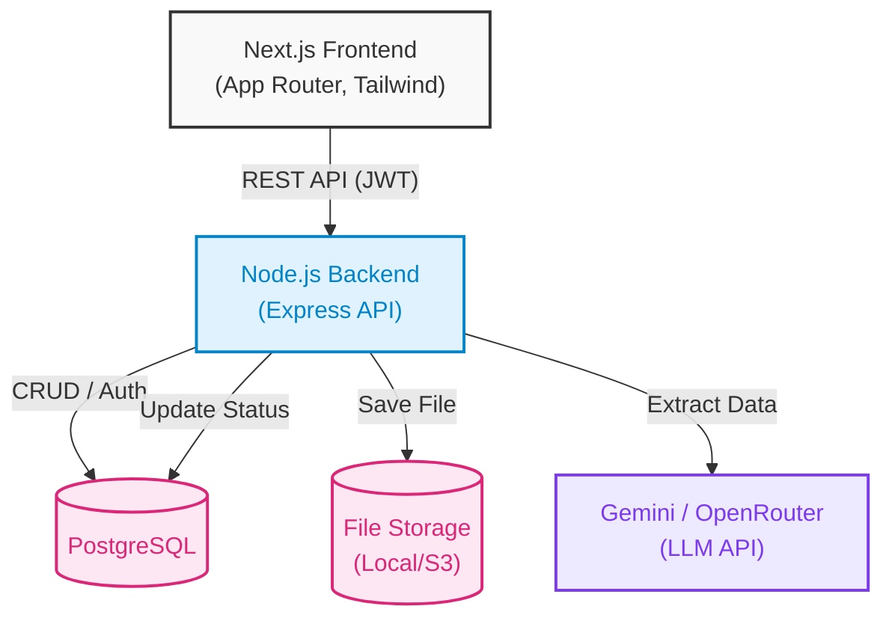

# ReceiptMind Enterprise

ReceiptMind is an intelligent expense automation and document extraction platform designed for finance teams, operations, and modern enterprises. By combining advanced AI models with reliable processing, it eliminates manual data entry, guarantees high extraction accuracy through exception handling, and automates organizational workflows.

## Architecture

The platform is built as a decoupled, multi-tenant application designed for performance, resilience, and easy deployment.



### Component Details

- **Frontend**: A Next.js 16 application utilising the App Router, Tailwind CSS, and React Query. The user interface prioritises minimal visual noise, fast page transitions, and structured datagrids for high-throughput expense management.
- **Backend API**: A Node.js and Express REST API that handles authentication, multi-tenant scoping, receipt ingestion, rules management, and administrative operations. Receipts are processed immediately in the background without requiring a separate queue.
- **Relational Storage**: PostgreSQL acts as the core database, storing relational structures for organizations, users, receipts, rules, and exception logs.

## Core Capabilities

- **AI Extraction Engine**: Extracts complex transactional schemas from raw images or PDFs using Google Gemini. The engine normalizes vendor names, amounts, tax details, GSTIN identifiers, currency codes, invoice numbers, and due dates.
- **Exceptions Inbox**: Receipts with extraction confidence below 75% or those missing critical compliance fields are flagged. They are routed to a human review queue, allowing operators to easily audit and correct entries.
- **Custom Rules Engine**: Allows organizations to build conditional criteria (such as vendor matches) that automatically assign categories, departments, or custom labels to receipts on ingestion.
- **Dual-Token JWT Authentication**: Uses short-lived access tokens and secure, database-verified, HTTP-only refresh tokens to manage persistent sessions safely.
- **Duplicate Prevention**: Computes cryptographic SHA-256 hashes of incoming payloads to identify and block duplicate receipts before database entry.
- **Data Portability**: Full search, date, and status filter criteria with an immediate CSV export builder.

## Local Development

### Prerequisites

You need PostgreSQL and Node.js (version 18 or above) installed on your machine.

### Setup Steps

1. **Clone the Repository**
   ```bash
   git clone https://github.com/dushyant4665/receiptmind.git
   cd receiptmind-enterprise
   ```

2. **Database Settings**
   Configure your PostgreSQL connection. Ensure your target PostgreSQL database is created.

3. **Backend Configuration**
   Navigate to the backend directory, copy `.env.example` to `.env`, and fill in the required variables (including your database credentials and Gemini API key).
   ```bash
   cd backend
   npm install
   # Run migrations
   node scripts/migrate_db.js
   # Start in development mode
   npm run dev
   ```

4. **Frontend Configuration**
   Navigate to the frontend directory, copy `.env.example` to `.env.local`, and point the API URL to your local backend.
   ```bash
   cd ../frontend
   npm install
   npm run dev
   ```

## Docker Deployment

To spin up the entire system locally inside containerized environments:

1. Configure your environment variables in `docker-compose.yml` or within your environment context.
2. Run the compose file:
   ```bash
   docker-compose up -d --build
   ```

## Production Deployment

### Backend (Render)

The backend service is designed to deploy on Render as a Web Service.

1. **New Web Service**: Connect your GitHub repository to Render.
2. **Build Configuration**:
   - Environment: Node
   - Root Directory: `backend`
   - Build Command: `npm install`
   - Start Command: `npm start`
3. **Environment Variables**: Add your production values for:
   - `DATABASE_URL` (PostgreSQL)
   - `JWT_SECRET`
   - `GEMINI_API_KEY`
4. **Health Check**: Configure `/health` as the monitoring endpoint.

### Frontend (Vercel)

The Next.js frontend is optimized for serverless hosting on Vercel.

1. **Import Project**: Import the repository into the Vercel dashboard.
2. **Project Settings**:
   - Framework Preset: Next.js
   - Root Directory: `frontend`
3. **Environment Variables**:
   - Set `NEXT_PUBLIC_API_URL` to your production Render backend URL.
4. **Deploy**: Click deploy. Vercel automatically builds, checks TypeScript types, and serves your client-side routes.
