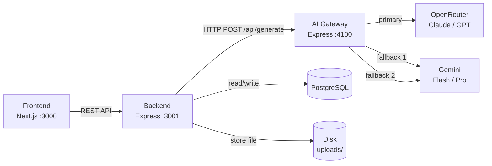
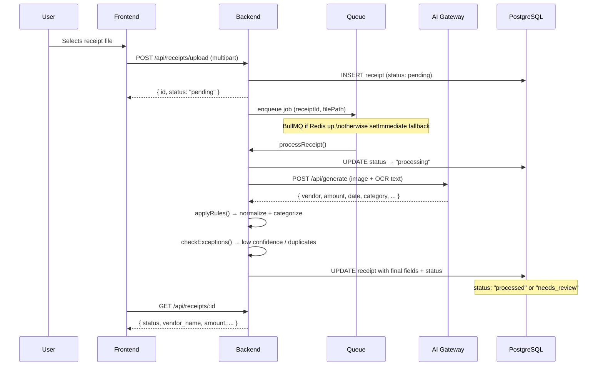
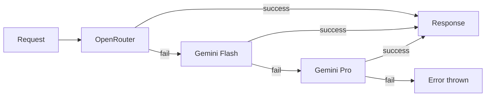

# ReceiptMind Enterprise

Receipt processing monorepo. Upload a receipt → AI extracts the data → rules auto-categorize → exceptions flag issues → review or export.

## What lives where

- `backend/` — Express API (auth, uploads, processing, rules, exceptions, exports)
- `frontend/` — Next.js UI (upload, dashboard, review, export screens)
- `ai-gateway/` — Standalone Express service for AI calls with provider failover
- `docs/` — Architecture notes

## System Architecture


```mermaid
graph LR
    FE["Frontend\nNext.js :3000"]
    BE["Backend\nExpress :3001"]
    GW["AI Gateway\nExpress :4100"]
    DB[(PostgreSQL)]
    DISK[(Disk\nuploads/)]
    OR["OpenRouter\nClaude / GPT"]
    GM["Gemini\nFlash / Pro"]

    FE -->|REST API| BE
    BE -->|store file| DISK
    BE -->|read/write| DB
    BE -->|HTTP POST /api/generate| GW
    GW -->|primary| OR
    GW -->|fallback 1| GM
    GW -->|fallback 2| GM
```

## Receipt Upload Flow


```mermaid
sequenceDiagram
    participant U as User
    participant FE as Frontend
    participant BE as Backend
    participant Q as Queue
    participant AI as AI Gateway
    participant DB as PostgreSQL

    U->>FE: Selects receipt file
    FE->>BE: POST /api/receipts/upload (multipart)
    BE->>DB: INSERT receipt (status: pending)
    BE-->>FE: { id, status: "pending" }

    BE->>Q: enqueue job (receiptId, filePath)
    Note over Q: BullMQ if Redis up,\notherwise setImmediate fallback

    Q->>BE: processReceipt()
    BE->>DB: UPDATE status → "processing"
    BE->>AI: POST /api/generate (image + OCR text)
    AI-->>BE: { vendor, amount, date, category, ... }
    BE->>BE: applyRules() → normalize + categorize
    BE->>BE: checkExceptions() → low confidence / duplicates
    BE->>DB: UPDATE receipt with final fields + status
    Note over DB: status: "processed" or "needs_review"

    FE->>BE: GET /api/receipts/:id
    BE-->>FE: { status, vendor_name, amount, ... }
```

## AI Provider Failover


```mermaid
flowchart LR
    R[Request] --> OR[OpenRouter]
    OR -->|fail| G1[Gemini Flash]
    G1 -->|fail| G2[Gemini Pro]
    OR -->|success| Res[Response]
    G1 -->|success| Res
    G2 -->|success| Res
    G2 -->|fail| E[Error thrown]
```

Each provider retries up to `AI_MAX_RETRIES` times with exponential backoff (300ms → 600ms → 1200ms) before falling to the next.

## Quick Start

```bash
# Install all
npm run install:all

# Run everything
npm run backend:dev    # :3001
npm run frontend:dev   # :3000
npm run gateway:dev    # :4100
```

## API Routes

| Method | Path | What it does |
|--------|------|-------------|
| `POST` | `/api/auth/register` | Create account |
| `POST` | `/api/auth/login` | Login → access + refresh tokens |
| `POST` | `/api/auth/refresh` | Rotate access token |
| `POST` | `/api/receipts/upload` | Upload receipt file |
| `GET` | `/api/receipts` | List receipts (paginated) |
| `GET` | `/api/receipts/:id` | Get single receipt |
| `PATCH` | `/api/receipts/:id` | Edit receipt fields |
| `DELETE` | `/api/receipts/:id` | Soft delete |
| `GET` | `/api/dashboard` | Stats (total, amounts, pending) |
| `GET` | `/api/exceptions` | List flagged exceptions |
| `POST` | `/api/exceptions/:id/resolve` | Resolve exception |
| `GET` | `/api/rules` | List org rules |
| `POST` | `/api/rules` | Create new rule |
| `GET` | `/api/metrics/processing-times` | Avg / min / max processing speed |
| `GET` | `/api/users/me` | Get profile |
| `PUT` | `/api/users/me` | Update profile |
| `GET` | `/api/receipts/export/csv` | Download CSV |
| `GET` | `/health` | Health check |

> All routes work with or without `/api` prefix (dual-mounted for frontend compatibility).

## Key Notes

- Auth uses JWT (access: 15m, refresh: 7d)
- Files saved to `uploads/` on disk, served via `/uploads/` static route
- Rules auto-learn: 3 manual same-vendor edits → permanent rule created
- Exception types: `low_confidence`, `missing_fields`, `potential_duplicate`, `processing_error`
- No Redis? Queue falls back to in-process async execution (no crash)
