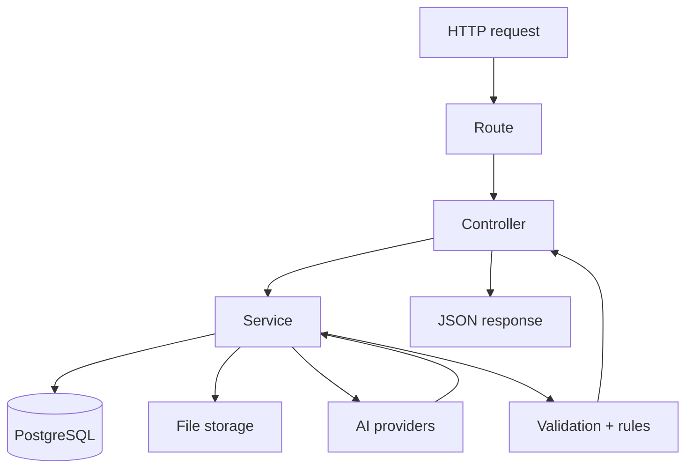

# ReceiptMind Backend

The backend is a small Express API that handles auth, receipt upload, extraction, rules, exceptions, file preview, CSV export, and email delivery.

## What It Does

- Accepts uploads and stores files on disk
- Extracts fields through OpenRouter, Gemini, and Tesseract fallback
- Validates, normalizes, and stores receipt data
- Applies rules and creates exceptions
- Serves receipt previews and CSV exports
- Sends verification and reset emails through Brevo

## Structure

```text
backend/
|- src/
|  |- config/
|  |- controllers/
|  |- db/
|  |- middleware/
|  |- routes/
|  |- services/
|  |- utils/
|  |- app.js
|  `- index.js
|- uploads/
|- exports/
`- tests/
```

## Key Flow



## Environment

Base values are in [`.env.example`](./.env.example).

Important variables:

- `PORT`
- `NODE_ENV`
- `DATABASE_URL`
- `JWT_SECRET`
- `JWT_REFRESH_SECRET`
- `OPENAI_API_KEY`
- `OPENAI_MODEL`
- `GEMINI_API_KEY`
- `GEMINI_MODEL`
- `GEMINI_FALLBACK_MODEL`
- `STORAGE_PATH`
- `BASE_URL`
- `FRONTEND_URL`
- `BREVO_API_KEY`
- `BREVO_FROM`

## Run

```bash
npm install
npm run dev
```

## Deploy on Render

- Root directory: `backend`
- Build command: `npm install && npm run build`
- Start command: `npm start`
- Node: 20+

## Notes

- `npm run build` is a no-op so Render has a stable build step.
- Files stay on local disk by default.
- Brevo keys stay on the backend only.
