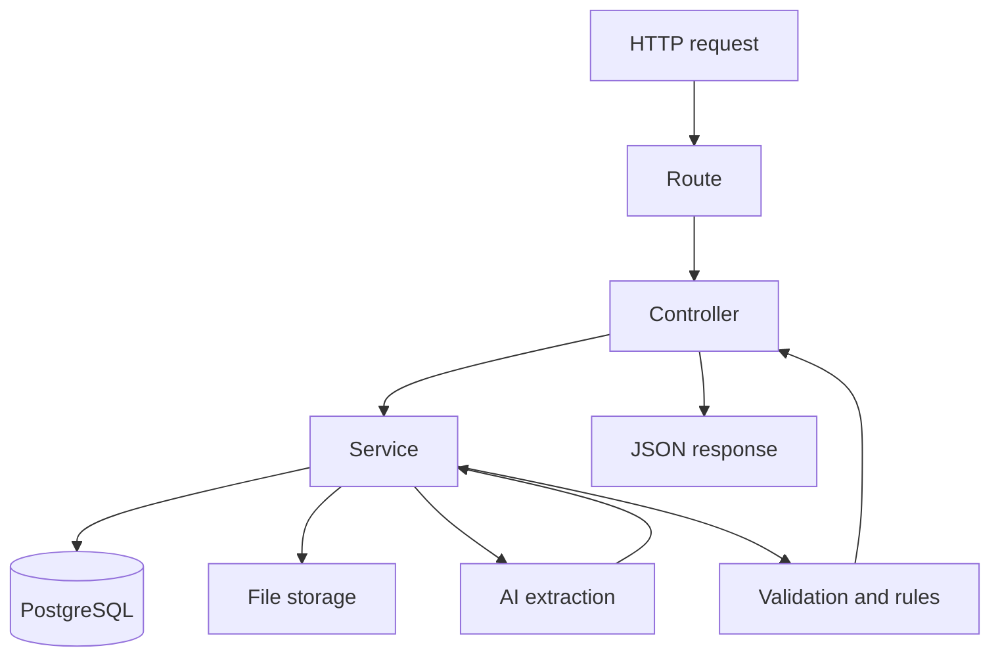

# ReceiptMind Backend

This package is the main Express API for ReceiptMind. It handles authentication, receipt upload, receipt processing, rules, exceptions, exports, file previews, and email delivery.

## What it does

- Accepts receipt uploads and stores files on disk
- Creates and updates receipt records in PostgreSQL
- Runs receipt extraction through `src/services/aiService.js`
- Uses OpenRouter first when configured, then Gemini, with retries and request timeouts
- Normalizes extracted data, applies business rules, and opens exceptions when needed
- Serves receipt preview links and CSV exports
- Sends verification and password-reset emails through Brevo

## Processing flow



## AI behavior

The receipt processor does not depend on the standalone `ai-gateway/` service. It calls the backend AI service directly.

- OpenRouter is used first when it is configured and the receipt type is supported
- Gemini is used as the fallback provider
- Gemini also has a separate fallback model
- Each provider call is wrapped with a timeout and retry loop

## Project structure

```text
backend/
|- src/
|  |- config/
|  |- controllers/
|  |- db/
|  |- middleware/
|  |- routes/
|  |- services/
|  |- utils/
|  |- workers/
|  |- app.js
|  `- index.js
|- exports/
`- storage/
```

## Environment

Base values live in [`.env.example`](./.env.example).

Important variables:

- `PORT`
- `NODE_ENV`
- `DATABASE_URL`
- `JWT_SECRET`
- `JWT_REFRESH_SECRET`
- `JWT_ACCESS_EXPIRATION`
- `JWT_REFRESH_EXPIRATION`
- `OPENROUTER_API_KEY`
- `OPENROUTER_MODEL`
- `OPENROUTER_APP_NAME`
- `OPENROUTER_APP_URL`
- `OPENAI_API_KEY`
- `OPENAI_MODEL`
- `GEMINI_API_KEY`
- `GEMINI_MODEL`
- `GEMINI_FALLBACK_MODEL`
- `AI_REQUEST_TIMEOUT_MS`
- `AI_MAX_RETRIES`
- `STORAGE_PATH`
- `BASE_URL`
- `FRONTEND_URL`
- `BREVO_API_KEY`
- `BREVO_FROM`

## Run locally

```bash
npm install
npm run dev
```

If you want receipt processing to run in the background, start the worker too:

```bash
npm run worker
```

## Notes

- `OPENAI_*` variables are kept as backward-compatible aliases for OpenRouter settings.
- Uploaded files stay on local disk by default.
- Brevo credentials should remain backend-only.
