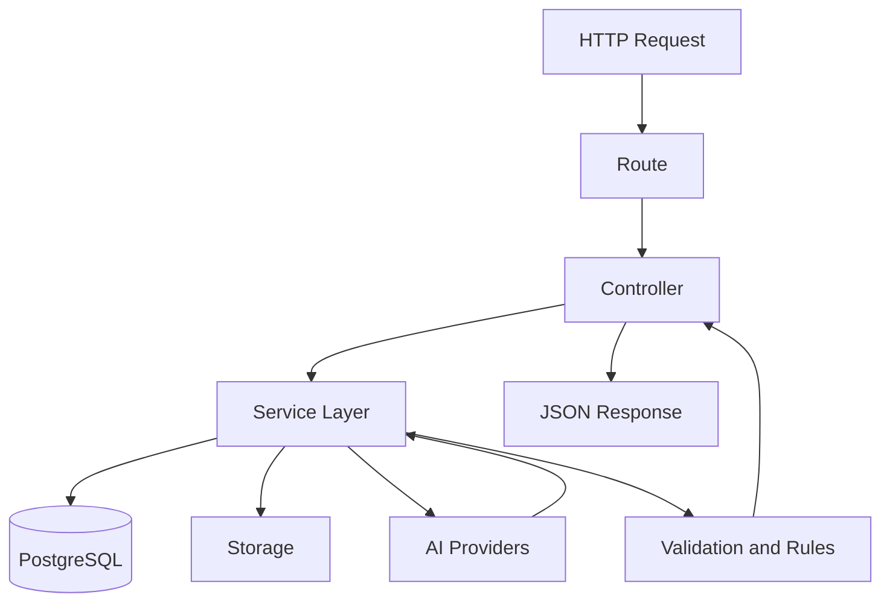
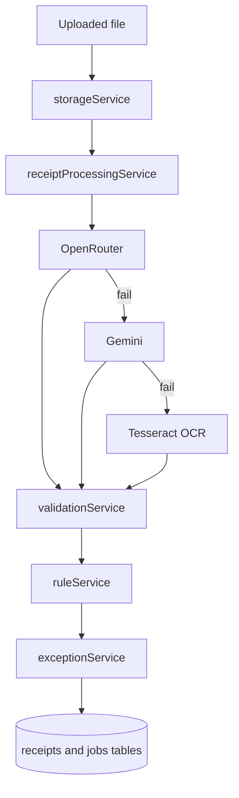

# ReceiptMind Backend

The backend is an Express service that handles authentication, receipt upload, AI extraction, rules, exception tracking, and CSV export.

## Responsibilities

- Accept receipt uploads and persist files
- Insert and update receipt processing jobs
- Extract structured fields through AI providers
- Normalize and validate extracted values
- Apply rules and create review exceptions
- Serve file previews and CSV exports

## Folder Layout

```text
backend/
|- src/
|  |- config/       # database connectivity and shared config
|  |- controllers/  # route handlers
|  |- db/           # SQL setup and migrations
|  |- middleware/   # auth and HTTP middleware
|  |- routes/       # API modules
|  |- services/     # business logic and provider integrations
|  |- utils/        # shared helpers
|  |- app.js
|  `- index.js
|- exports/
|- uploads/
`- tests/
```

## Request Lifecycle



## Extraction Pipeline



## Environment Variables

Base configuration is documented in [`.env.example`](./.env.example).

Common production variables:

- `PORT`
- `NODE_ENV`
- `DATABASE_URL`
- `JWT_SECRET`
- `JWT_REFRESH_SECRET`
- `OPENAI_API_KEY`
- `OPENAI_MODEL`
- `GEMINI_API_KEY`
- `GEMINI_MODEL`
- `GEMINI_FALLBACK_MODEL`
- `STORAGE_PATH`
- `BASE_URL`
- `FRONTEND_URL`

## Local Run

```bash
npm install
npm run dev
```

Health check:

```bash
curl http://localhost:3001/health
```

## Render Deployment

Recommended Render settings:

- Root Directory: `backend`
- Build Command: `npm install && npm run build`
- Start Command: `npm start`
- Environment: `Node`

`npm run build` is intentionally present even though the backend is not transpiled. This avoids Render build failures and keeps the deploy contract explicit.

## Notes

- Local file storage is the current default. If you move to object storage later, `storageService` is the right integration boundary.
- OCR fallback only runs for image uploads.
- CSV exports are generated on the backend and stored in `exports/`.
