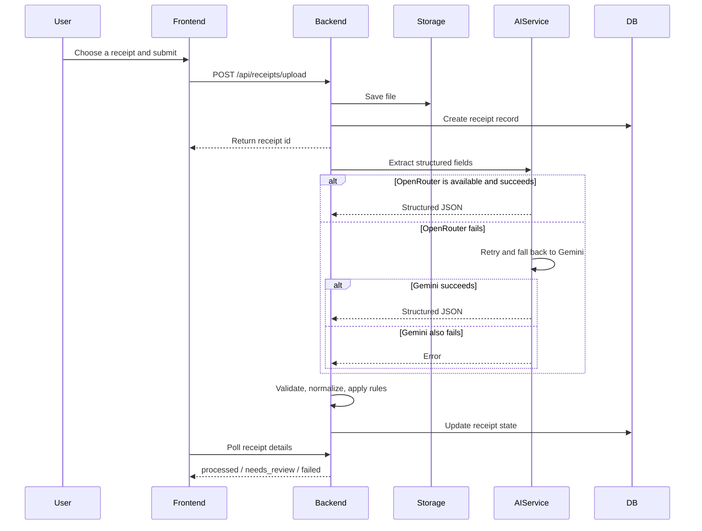
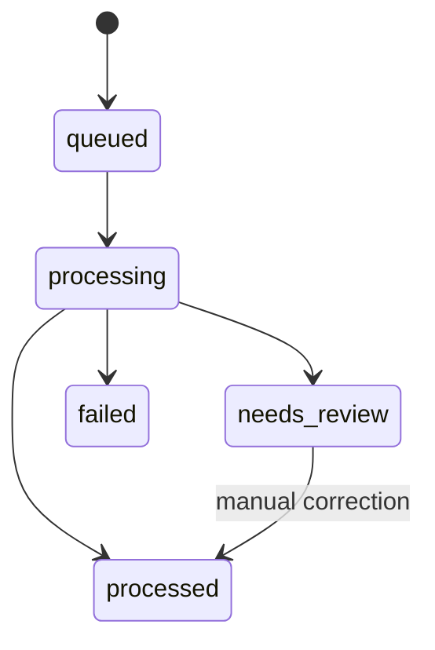

# Receipt Processing Flow

This page describes the real receipt lifecycle in the backend, from upload to final receipt state.

## End-to-end flow

## State model

## High-level modules

- `receiptController`: upload and receipt-facing HTTP endpoints
- `authController`: registration, verification, password reset, and session flows
- `emailService`: Brevo API integration for verification and password reset email
- `receiptProcessingService`: orchestrates file download, AI extraction, rules, and status transitions
- `aiService`: receipt extraction fallback chain with timeout and retry handling
- `ai-gateway/`: standalone TypeScript gateway for chat-style AI requests
- `validationService`: field cleanup, normalization, and confidence handling
- `ruleService`: business rule application
- `exceptionService`: review issue creation
- `fileController`: signed file preview endpoint
- `exportController`: CSV export and export history
- `storageService`: file save and file read operations

## Failure boundaries

- Upload failure: request never creates a receipt record
- Email provider failure: the pending registration or reset token still exists, but the response reports `email_sent: false`
- Extraction failure: receipt is stored but marked `failed`
- Low-confidence extraction: receipt moves to `needs_review`
- Provider outage: the processor tries the next configured AI provider

## Operational summary

- Storage is synchronous at upload time
- Extraction starts after the initial upload acknowledgement
- Frontend status updates are polling-based
- CSV export is independent of receipt extraction and reads persisted data from the database
- Verification and reset emails use Brevo's HTTPS API from the backend
