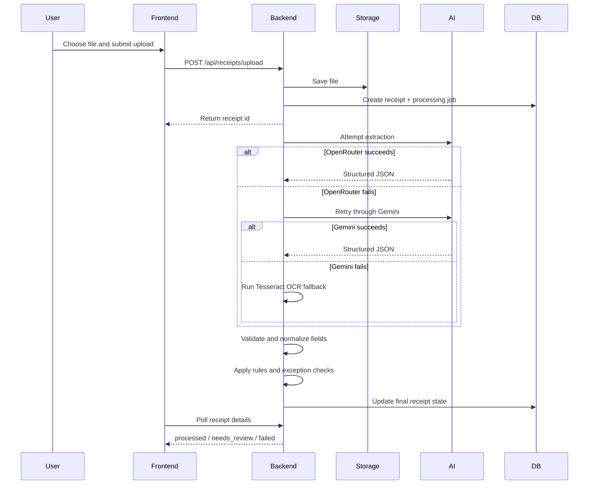
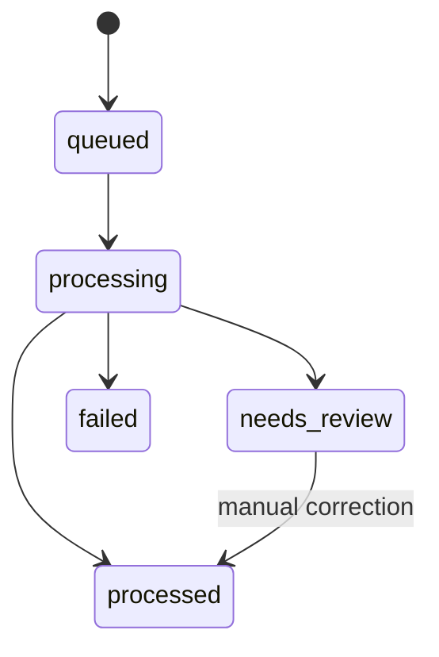

# Receipt Processing Flow

This document explains the high-level flow of the live system from upload to final review state.

## End-to-End Flow

## State Model

## High-Level Modules

- `receiptController`: upload and receipt-facing HTTP endpoints
- `receiptProcessingService`: queue orchestration and status transitions
- `aiService`: provider selection and extraction fallback chain
- `validationService`: field cleanup, normalization, confidence handling
- `ruleService`: business rule application
- `exceptionService`: review issue creation
- `storageService`: file save and file read operations

## Failure Boundaries

- Upload failure: request never creates a receipt record
- Extraction failure: receipt is stored but marked `failed`
- Low-confidence extraction: receipt moves to `needs_review`
- Provider outage: system falls through to the next extraction layer

## Operational Summary

- Storage is synchronous at upload time.
- Extraction is asynchronous after the initial acknowledgement.
- Frontend status updates are polling-based.
- CSV export is independent of receipt extraction and reads persisted data from the database.
