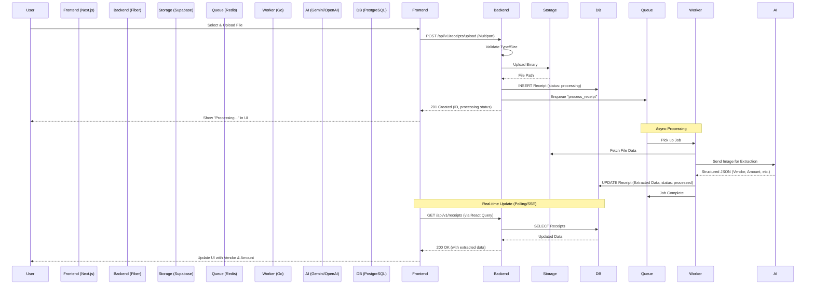

# ReceiptMind System Flow

This document describes the end-to-end flow of data and actions within the ReceiptMind platform.

## 1. Receipt Upload & Processing Flow

The core feature of ReceiptMind is the AI-powered extraction of data from uploaded receipts.

### Step-by-Step Breakdown:

1.  **Frontend Interaction:** The user interacts with `UploadDropzone.tsx`. The file is sent to the backend using the `uploadApiData` helper in `api-client.ts`.
2.  **Synchronous Backend Handling:**
    *   `ReceiptHandler.Upload` validates the file.
    *   The file is stored in Supabase Storage via `StorageService`.
    *   A database record is created immediately with `status: processing`.
    *   A task is pushed to Redis using `QueueService`.
    *   The user gets an immediate response, keeping the UI responsive.
3.  **Asynchronous Background Worker:**
    *   A background `Worker` (started in `main.go`) pulls jobs from Redis.
    *   It uses `AIService` to communicate with Gemini (primary) or OpenAI (fallback).
    *   The AI "sees" the receipt image and returns structured JSON.
    *   The worker updates the database with the extracted fields (vendor name, total amount, date, category).
4.  **UI Synchronization:**
    *   The frontend uses TanStack React Query (`useReceipts` hook).
    *   It polls or revalidates the data, seeing the status change from `processing` to `processed`.
    *   Toast notifications inform the user when the extraction is finished.

---

## 2. Authentication Flow

ReceiptMind uses JWT-based authentication integrated with NextAuth.

1.  **Direct Registration:** User submits details to `/api/v1/auth/register`. The organization and user are created immediately.
2.  **Token Generation:** Backend verifies credentials and returns an `access_token` (short-lived) and `refresh_token` (long-lived).
3.  **Session Management:** NextAuth stores these tokens in a secure cookie.
4.  **Authorized Requests:**
    *   `api-client.ts` uses an Axios interceptor to attach the `Authorization: Bearer <token>` header to every request.
    *   Backend `AuthMiddleware` verifies the JWT and injects `user_id` and `organization_id` into the request context (`c.Locals`).
5.  **Token Expiry:** If a request returns `401 Unauthorized`, the frontend interceptor triggers a sign-out flow.

---

## 3. Categorization & Rules Flow

1.  **Manual Edit:** User edits a receipt's category.
2.  **Auto-Learning:** If "Create rule after save" is checked, the frontend calls `POST /api/v1/rules`.
3.  **Rule Application:**
    *   Future uploads are matched against existing rules in `RuleService`.
    *   If a vendor matches, the category is applied automatically during the background worker phase.

---

## 4. Exception Handling Flow

1.  **Detection:** During AI extraction, if `confidence < 0.75` or fields are missing, the `ExceptionService` creates an exception record linked to the receipt.
2.  **User Review:** The "Exceptions" page in the dashboard lists these receipts.
3.  **Resolution:** User corrects the data, which updates the receipt and marks the exception as `resolved`.
